<div align="center">
  
  <h1>📝 Auto-Doc</h1>
  <p><strong>Your personal code diary. Automatically document every change, every save, without lifting a finger.</strong></p>
</div>

[](https://marketplace.visualstudio.com/items?itemName=ni3dev.auto-document)
[](https://marketplace.visualstudio.com/items?itemName=ni3dev.auto-document)
[](https://marketplace.visualstudio.com/items?itemName=ni3dev.auto-document)
[](https://marketplace.visualstudio.com/items?itemName=ni3dev.auto-document)

---

## 🚀 What is Auto-Doc?

**Auto-Doc** is a powerful yet simple VS Code extension designed for developers who need to keep a running diary of their work. It silently monitors your file saves, intelligently detects changes, and creates a detailed log in an easy-to-read Markdown file.

> **Perfect for:** Code reviews, debugging sessions, tracking progress, and maintaining project history without the manual effort.

---

## ✨ Key Features

### 🔄 **Automatic Change Tracking**
- Works silently in the background
- Triggers on every file save (`Ctrl+S` / `Cmd+S`)
- Zero configuration required

### 🎯 **Precise Diff Detection**
- Identifies exact lines added or removed
- Shows line numbers for easy reference
- Clean, readable diff format

### 📋 **Smart Documentation**
- Creates `.autodoc-log.md` in your project root
- Newest changes appear at the top
- Markdown format for easy viewing and sharing

### 🎮 **Simple Controls**
- Status bar indicator shows logging status
- Click to toggle on/off instantly
- Command palette integration

---

## 🛠️ Installation & Setup

1. **Install from VS Code Marketplace**
   ```
   ext install ni3dev.auto-document
   ```

2. **Open your project folder**
   - Auto-Doc will automatically initialize
   - Look for the status bar indicator

3. **Start coding!**
   - Save any file to create your first log entry
   - Check the `.autodoc-log.md` file in your project root

---

## 💡 How It Works

```mermaid
graph LR
    A[Code & Save] --> B[Auto-Doc Detects Changes]
    B --> C[Generate Diff]
    C --> D[Append to Log File]
    D --> E[📄 .autodoc-log.md Updated]
```



### Sample Log Entry
```markdown
## 📝 Changes on 2024-01-15 at 14:30:25
**File:** `src/main.js`

### Lines Added:
- Line 23: `console.log('Debug: User logged in');`
- Line 45: `return userData.filter(user => user.active);`

### Lines Removed:
- Line 22: `// TODO: Add logging here`
- Line 44: `return userData;`
```

---

## ⌨️ Available Commands

Open Command Palette (`Ctrl+Shift+P` / `Cmd+Shift+P`) and search for:

| Command | Description |
|---------|-------------|
| `Auto-Doc: Open Log File` | 📂 Instantly open your documentation file |
| `Auto-Doc: Toggle Logging` | ⏯️ Pause/resume automatic logging |
| `Auto-Doc: Export to PDF` | 📄 Generate a PDF version of your log |

---

## 🎛️ Status Bar Integration

The Auto-Doc status bar item shows:
- **📝 Auto-Doc: ON** - Logging is active
- **📝 Auto-Doc: OFF** - Logging is paused

Click the status bar item to quickly toggle logging on/off.

---

## 🔧 Use Cases

### For Individual Developers
- **Debug Tracking**: Never lose track of what changed when debugging
- **Feature Development**: Document your thought process and iterations
- **Learning**: Review your coding patterns and improvements over time

### For Teams
- **Code Reviews**: Share detailed change logs with teammates
- **Knowledge Transfer**: Help new team members understand code evolution
- **Project History**: Maintain comprehensive development timelines

---

## 📊 Why Choose Auto-Doc?

| Traditional Documentation | Auto-Doc |
|--------------------------|----------|
| ❌ Manual effort required | ✅ Completely automatic |
| ❌ Easy to forget | ✅ Never miss a change |
| ❌ Time-consuming | ✅ Zero overhead |
| ❌ Inconsistent format | ✅ Standard Markdown |

---

## 🛣️ Roadmap

- **v2.0**: Team collaboration features
- **v2.1**: Cloud sync capabilities
- **v2.2**: Custom log templates
- **v2.3**: Integration with Git workflows
- **v2.4**: Advanced filtering and search

---

## 🤝 Contributing

Found a bug or have a feature request? We'd love to hear from you!

- 🐛 **Report Issues**: [GitHub Issues](https://github.com/ni3dev/auto-doc/issues)
- 💡 **Feature Requests**: Share your ideas with the community
- ⭐ **Rate & Review**: Help others discover Auto-Doc on the marketplace

---

## 📜 License

This project is licensed under the MIT License - see the [LICENSE](LICENSE) file for details.

---

<div align="center">
  
**Made with ❤️ for developers who value their time**

[Install Now](https://marketplace.visualstudio.com/items?itemName=ni3dev.auto-document) • [Documentation](https://marketplace.visualstudio.com/items?itemName=ni3dev.auto-document) • [Support](ni3.singh.r@gmail.com)

</div>
